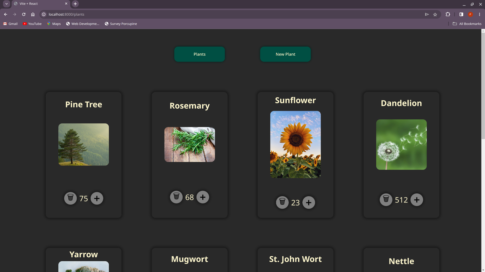
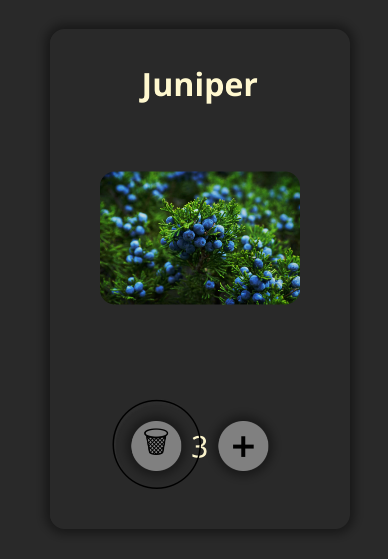
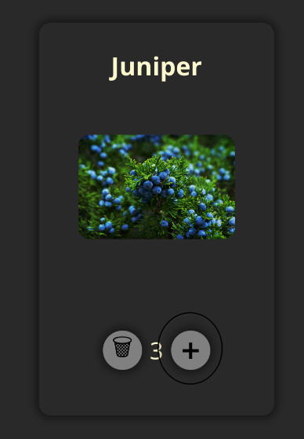
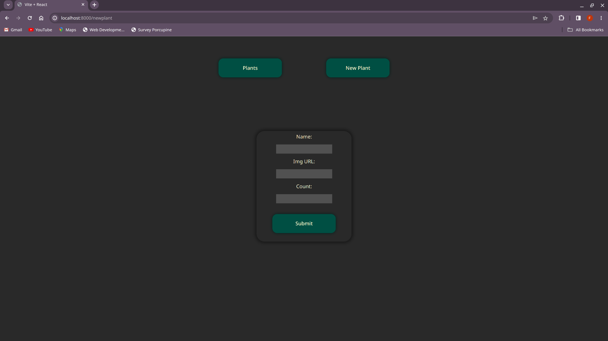
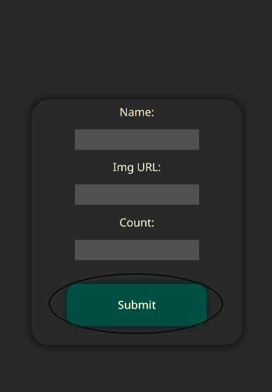

# NoDB Project for DevMountain

This project is purely a proof-of-concepts, however the documentation will be treated as that of a genuine project, for the sake of my grade. The premise of the project is a web app where we can keep track of the plants in Utah that people see the most. Theoretically, the more of a given type of plant in utah, the more people that will see it, and therefore the higher the count should increment. Unfortunately this is a NoDB project, which means there is no real database. I could write to the filesystem on a web-server, but I was not required to, and this is purely a proof-of-concepts project.

##

### Install

The only real dependency is nodejs/npm. If you're just an average Joe, you should be able to find an install somewhere on this site: https://nodejs.org/en/download. OR, if you're superior, you can just run:

`sudo pacman -S nodejs npm`

After installing nodejs and npm, you can run these commands to launch the project locally.

`git clone https://github.com/Varuna3/NoDB.git`

`cd NoDB`

`npm i`

`npm run dev`

## UT Plant Tracker

An app to keep track of the amount of a given type of plant there are in Utah, with 'features' designed to allow anyone to increment the count of a type of plant.

### Plants Button

This button will take you to the "Plants" page, where you can see all of the plants that different people have found in Utah.

### NewPlant Button

This button will take you to the "NewPlant" page, where you can add a new plant to the collection of plants on the "Plants" page.

## Plants Page

This page displays a collection of all of the plants that people in Utah have discovered. Each plant has it's own dedicated space, with a title of the plant, an image of the plant, and a counter that shows how many times someone has seen that plant in Utah. It also has a button to increment that counter, incase you see one yourself.

### Trash Button

This button is an absolute last resort. If you think somebody has thrown a plant into the collection that doesn't really exist, you can push the trash button to _COMPLETELY_ destroy the plant, and all data associated with it. It will be obliterated. It's existence will be no more. It will not only be sent to the realm from which no one may return, but it will also be shredded into more pieces than there are grains of sand in the universe. You have been warned.

### Plus Button

This button will increment the count associated with a plant by one. Press it once every time you see the associated plant, so we can keep track of the number of times someone has seen a given plant in Utah.

## NewPlant Page

This page lets you add a completely new plant to the collection of plants. You must specify a name, image URL, and the number that you originally saw, and then click the "Submit" button.

### Name Field

This field will keep track of the characters you're entering (preferably a string), and will pass it through to a new plant card after you hit submit.

### Image URL Field

This field will keep track of the characters you're entering, (preferably a string / URL), and will pass it through to a new plant card after you hit submit.

### Count Field

This field will keep track of the characters you're entering, (preferably a number), and will pass it through to a new plant card after you hit submit.

### Submit Button

This button will submit the form you've filled out after you've filled it out, and then will store the information in the collection of plants, and display it on the plants page!
